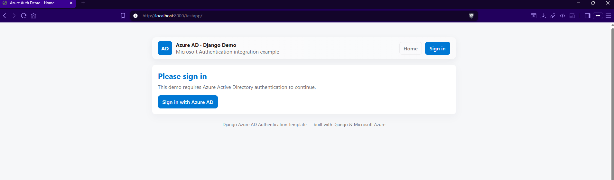
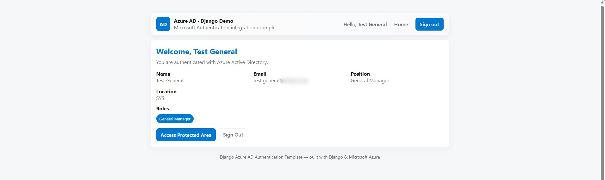
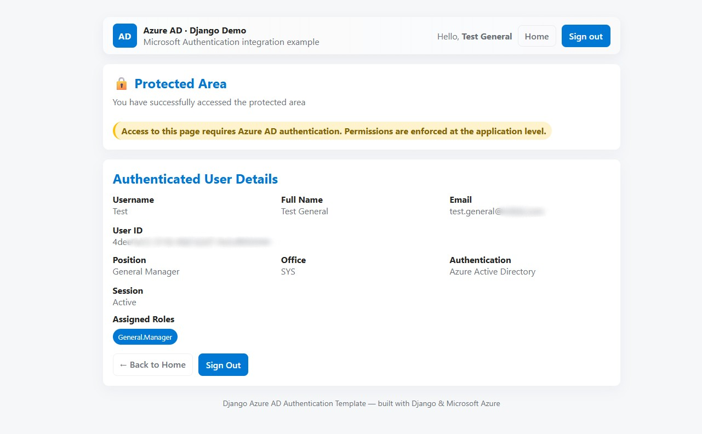
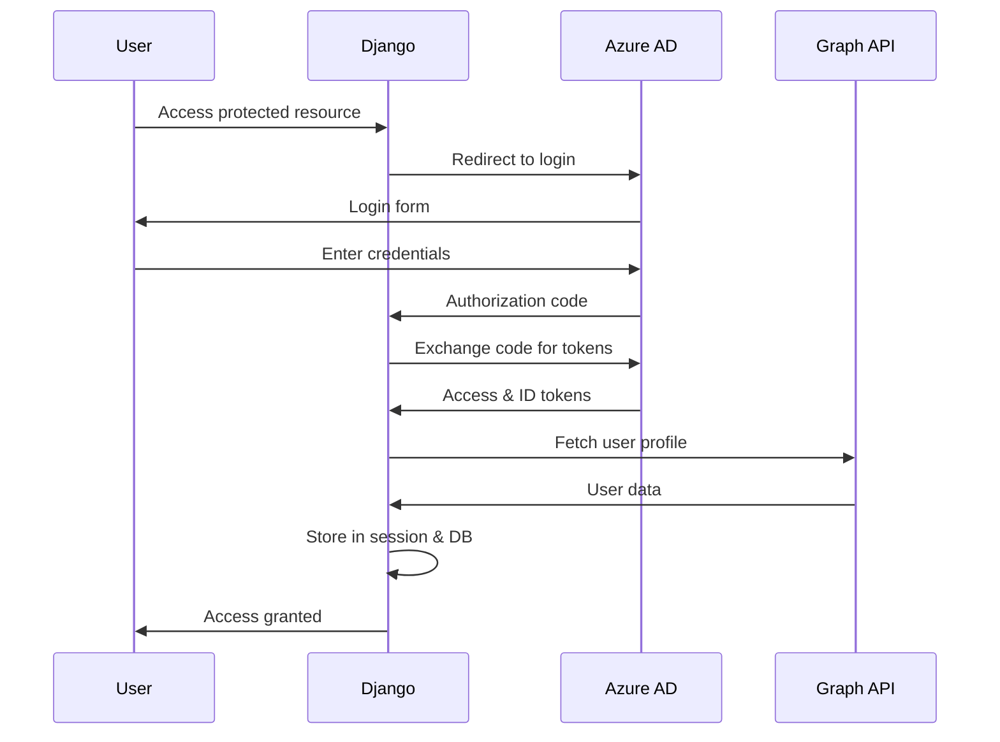

# Django Microsoft Azure AD Authentication Demo

A comprehensive Django application demonstrating Microsoft Azure Active Directory (Azure AD) authentication integration using the `django-azure-auth` library. This project showcases enterprise-grade authentication with role-based access control, custom backends, middleware, and context processors.

   

## 📸 Application Screenshots

### Home Page - Unauthenticated User


### Home Page - Authenticated User 


### Protected Area


## 🎯 Overview

This Django application provides a complete implementation of Microsoft Azure AD authentication, including:

- **Single Sign-On (SSO)** with Microsoft Azure AD
- **Role-based access control** with Azure AD groups
- **Custom authentication backend** for enhanced user data handling
- **Middleware integration** for seamless user context management
- **Pydantic schema validation** for type-safe user data
- **Database persistence** of Azure user profiles
- **Template context processors** for easy template access
- **Professional UI** with responsive design

## 🚀 Features

### Core Authentication Features
- ✅ Microsoft Azure AD OAuth 2.0 integration
- ✅ Automatic user creation and synchronization
- ✅ Role and group mapping from Azure AD
- ✅ Protected views with decorators
- ✅ Custom authentication backend
- ✅ Session-based user data storage
- ✅ Graph API integration for user profiles

### Advanced Components
- ✅ **Custom Middleware**: Automatic user context injection
- ✅ **Context Processors**: Template-ready user data
- ✅ **Pydantic Schemas**: Type-safe user data validation
- ✅ **Database Models**: Persistent user profile storage
- ✅ **Professional Templates**: Modern, responsive UI design

## 📋 Prerequisites

- Python 3.11 or higher
- [UV Package Manager](https://github.com/astral-sh/uv) (recommended)
- Microsoft Azure AD tenant
- Azure application registration

## 🛠️ Installation

### 1. Clone the Repository

```bash
git clone https://github.com/yourusername/django-microsoft-auth.git
cd django-microsoft-auth
```

### 2. Set Up Python Environment with UV

This project uses [UV](https://github.com/astral-sh/uv) for fast, reliable Python package management:

```bash
# Install UV if you haven't already
curl -LsSf https://astral.sh/uv/install.sh | sh

# Create virtual environment and install dependencies
uv sync

# Activate the virtual environment
# On Windows:
.venv\Scripts\activate
# On macOS/Linux:
source .venv/bin/activate
```

**Alternative using pip:**
```bash
pip install -e .
```

### 3. Configure Azure AD Application

#### Step 1: Register Application in Azure Portal

1. Navigate to [Azure Portal](https://portal.azure.com)
2. Go to **Azure Active Directory** > **App registrations**
3. Click **New registration**
4. Fill in the application details:
   - **Name**: `Django Auth Demo`
   - **Supported account types**: Choose based on your needs
   - **Redirect URI**: `http://localhost:8000/azure_auth/callback`

#### Step 2: Configure Application Settings

1. After registration, note down:
   - **Application (client) ID**
   - **Directory (tenant) ID**

2. Go to **Certificates & secrets**:
   - Click **New client secret**
   - Add description and select expiration
   - **Copy the secret value** (you won't see it again!)

#### Step 3: Set API Permissions

1. Go to **API permissions**
2. Click **Add a permission** > **Microsoft Graph** > **Delegated permissions**
3. Add the following permissions:
   - `User.Read` - Read user profile
   - `User.Read.All` - Read all users' profiles
   - `Group.Read.All` - Read all groups
4. Click **Grant admin consent** for your tenant

### 4. Environment Configuration

Create a `.env` file in the `AzureAuthTemplate/AzureAuthTemplate/` directory by copying the example file:

```bash
cp .env.example AzureAuthTemplate/AzureAuthTemplate/.env
```

Then fill in your actual Azure AD credentials in the `.env` file:

```env
# Azure AD Configuration
AZURE_CLIENT_ID='your-application-client-id'
AZURE_CLIENT_SECRET='your-client-secret-value'
AZURE_TENANT_ID='your-tenant-id'
AZURE_AUTHORITY='https://login.microsoftonline.com/'
AZURE_SCOPES='User.Read,User.Read.All,Group.Read.All'

# Django Configuration
SECRET_KEY='your-django-secret-key-here'
DEBUG=True
```

```env
# Azure AD Configuration
AZURE_CLIENT_ID='your-application-client-id'
AZURE_CLIENT_SECRET='your-client-secret-value'
AZURE_TENANT_ID='your-tenant-id'
AZURE_AUTHORITY='https://login.microsoftonline.com/'
AZURE_SCOPES='User.Read,User.Read.All,Group.Read.All'
```

#### Environment Variables Explanation

| Variable | Description | Example |
|----------|-------------|---------|
| `AZURE_CLIENT_ID` | Application (client) ID from Azure portal | `your-application-client-id` |
| `AZURE_CLIENT_SECRET` | Client secret value | `your-client-secret-value` |
| `AZURE_TENANT_ID` | Directory (tenant) ID | `your-tenant-id` |
| `AZURE_AUTHORITY` | Microsoft authority URL | `https://login.microsoftonline.com/` |
| `AZURE_SCOPES` | Comma-separated list of required scopes | `User.Read,User.Read.All,Group.Read.All` |

### 5. Database Setup

```bash
cd AzureAuthTemplate
python manage.py makemigrations
python manage.py migrate
```

### 6. Run the Development Server

```bash
python manage.py runserver
```

Visit `http://localhost:8000` to see the application in action!

The application will display:
- **Landing page** with login option for unauthenticated users
- **Authenticated home page** showing user profile information from Azure AD
- **Protected area** accessible only after Azure AD authentication

## 🏗️ Architecture & Implementation

### Authentication Flow



### Core Components

#### 1. Custom Authentication Backend (`backends.py`)

The `CustomAzureBackend` extends the `django-azure-auth` library's backend to provide enhanced functionality:

```python
class CustomAzureBackend(AzureBackend):
    def authenticate(self, request, token=None, **kwargs):
        # Enhanced authentication with session storage
        # Custom user data mapping and persistence
```

**Key Features:**
- Extends base Azure authentication
- Maps Azure AD claims to session data
- Stores user profiles in database
- Handles role mapping and validation
- Provides secure string sanitization

#### 2. Middleware Integration (`middleware.py`)

The `AzureUserMiddleware` automatically injects user context into every request:

```python
class AzureUserMiddleware(MiddlewareMixin):
    def process_request(self, request):
        # Attach azure_user to request object
        # Validate with Pydantic schemas
        # Hydrate from database if available
```

**Functionality:**
- Attaches `request.azure_user` (Pydantic model)
- Attaches `request.azure_user_db` (Django model)
- Validates user data structure
- Provides fallback mechanisms

#### 3. Template Context Processors (`context_processors.py`)

Automatic template context injection for seamless template access:

```python
def azure_user_context(request):
    # Expose azure_user in all templates
    # Handle Pydantic serialization
    # Provide safe fallbacks
```

#### 4. Pydantic Schema Validation (`schemas.py`)

Type-safe user data handling with Pydantic:

```python
class AzureUserSchema(BaseModel):
    user_id: str
    name: Optional[str]
    email: Optional[EmailStr]
    roles: List[str] = []
    # Additional fields with validation
```

#### 5. Database Models (`models.py`)

Persistent storage for Azure user profiles:

```python
class AzureUser(models.Model):
    user_id = models.CharField(max_length=255, unique=True)
    # Additional fields for user data
    # JSON storage for roles
    # Automatic timestamp tracking
```

### Template Integration

#### Django Template Tags
The templates use standard Django template syntax with custom context:

```html
<!-- Access authenticated user data -->

    <h2>Welcome, {{ azure_user.name }}</h2>
    <p>Email: {{ azure_user.email }}</p>
    
    <!-- Display user roles -->
    
        <span class="role">{{ role }}</span>
    

```

#### Professional UI Components

The templates include a modern, responsive design system:

- **Clean CSS3 styling** with CSS custom properties
- **Responsive grid layouts** for optimal display
- **Professional color scheme** following Microsoft design guidelines
- **Accessible components** with proper ARIA attributes
- **Mobile-first responsive design**

## 🔧 Configuration Deep Dive

### Azure AD Settings (`settings.py`)

```python
AZURE_AUTH = {
    "CLIENT_ID": env.str("AZURE_CLIENT_ID"),
    "CLIENT_SECRET": env.str("AZURE_CLIENT_SECRET"),
    "REDIRECT_URI": "http://localhost:8000/azure_auth/callback",
    "SCOPES": env.list("AZURE_SCOPES"),
    "AUTHORITY": f"{env.str('AZURE_AUTHORITY')}{env.str('AZURE_TENANT_ID')}",
    "ROLES": {
        # Map Azure AD group IDs to role names
        "group-id-1": "Admin",
        "group-id-2": "User",
    },
    "USERNAME_ATTRIBUTE": "displayName",
    "GROUP_ATTRIBUTE": "roles",
    "EXTRA_FIELDS": ["givenName", "mail", "officeLocation", "jobTitle", "id"],
    "GRAPH_USER_ENDPOINT": "https://graph.microsoft.com/v1.0/me",
}
```

### Middleware Configuration

```python
MIDDLEWARE = [
    # ... other middleware
    'django.contrib.auth.middleware.AuthenticationMiddleware',
    'testapp.middleware.AzureUserMiddleware',  # After auth middleware
]
```

### Authentication Backend

```python
AUTHENTICATION_BACKENDS = (
    "AzureAuthTemplate.backends.CustomAzureBackend",
)
```

## 🎨 Template System

### Template Hierarchy

```
templates/
├── base.html          # Base template with navigation and styling
├── home.html          # Public/authenticated home page
└── protected.html     # Protected area requiring authentication
```

### Template Features

1. **Responsive Design**: Mobile-first approach with CSS Grid
2. **Professional Styling**: Clean, modern interface
3. **User Context**: Automatic Azure user data injection
4. **Role Display**: Visual representation of user roles
5. **Authentication Status**: Clear login/logout states

### Custom Template Tags

The templates utilize Django's template system with enhanced context:

```html
<!-- User authentication check -->

    <!-- Authenticated user content -->

    <!-- Fallback for standard Django auth -->

    <!-- Anonymous user content -->

```

## 🔒 Security Features

### Authentication Security
- **OAuth 2.0** with PKCE (Proof Key for Code Exchange)
- **JWT token validation** with Azure AD
- **Secure session management** with Django sessions
- **CSRF protection** on all forms
- **XSS prevention** with template auto-escaping

### Data Protection
- **Environment variable** configuration for sensitive data
- **Secure string sanitization** in custom backend
- **SQL injection protection** with Django ORM
- **Input validation** with Pydantic schemas

### Access Control
- **Role-based permissions** with Azure AD groups
- **Protected view decorators** (`@azure_auth_required`)
- **Middleware-level** authentication checks
- **Template-level** permission controls

## 🧪 Testing

### Running Tests

```bash
cd AzureAuthTemplate
python manage.py test testapp
```

### Test Coverage

The application includes tests for:
- Authentication flow
- User data processing
- Template context
- Database operations
- Security validations

## 📱 Usage Examples

### Protected Views

```python
from azure_auth.decorators import azure_auth_required

@azure_auth_required
def protected_view(request):
    # Access authenticated user
    azure_user = request.azure_user
    return render(request, 'protected.html', {
        'user_name': azure_user.name,
        'user_roles': azure_user.roles,
    })
```

### Template Usage

```html
<!-- Display user information -->
<div class="user-info">
    <h3>{{ azure_user.name }}</h3>
    <p>{{ azure_user.email }}</p>
    <p>Position: {{ azure_user.position }}</p>
    <p>Office: {{ azure_user.office_location }}</p>
</div>

<!-- Role-based content -->

    <div class="admin-panel">
        <!-- Admin-only content -->
    </div>

```

### Programmatic Access

```python
def dashboard_view(request):
    # Access via middleware-injected attribute
    user = request.azure_user
    
    # Access via database model
    db_user = request.azure_user_db
    
    # Access via session (fallback)
    session_user = request.session.get('user')
    
    return render(request, 'dashboard.html', {
        'azure_user': user,
        'last_seen': db_user.last_seen if db_user else None,
    })
```

## 🚀 Deployment

### Production Settings

For production deployment, update the following:

1. **Environment Variables**:
```env
DEBUG=False
ALLOWED_HOSTS=yourdomain.com,www.yourdomain.com
SECRET_KEY=your-production-secret-key
```

2. **Azure AD Redirect URI**:
```
https://yourdomain.com/azure_auth/callback
```

3. **Database Configuration**:
```python
DATABASES = {
    'default': {
        'ENGINE': 'django.db.backends.postgresql',
        'NAME': 'your_db_name',
        'USER': 'your_db_user',
        'PASSWORD': 'your_db_password',
        'HOST': 'your_db_host',
        'PORT': '5432',
    }
}
```

## 📚 Dependencies

This project uses **UV** for fast and reliable Python package management. All dependencies are defined in `pyproject.toml`.

### Core Dependencies

- **Django 4.2.6**: Web framework
- **django-azure-auth 2.3.0**: Azure AD integration
- **environs 14.3.0**: Environment variable management
- **pydantic[email] 2.11.9**: Data validation and serialization
- **psycopg2 2.9.10**: PostgreSQL adapter (production)

### Development Dependencies

Install additional packages for development using UV:

```bash
uv add --dev django-debug-toolbar pytest-django black flake8
```

Or add them manually to your `pyproject.toml` under `[project.optional-dependencies]`.

## 🤝 Contributing

1. Fork the repository
2. Create a feature branch (`git checkout -b feature/amazing-feature`)
3. Commit your changes (`git commit -m 'Add some amazing feature'`)
4. Push to the branch (`git push origin feature/amazing-feature`)
5. Open a Pull Request

## 📄 License

This project is licensed under the MIT License - see the [LICENSE](LICENSE) file for details.

## 🙋‍♂️ Support

If you encounter any issues or have questions:

1. Check the [Issues](https://github.com/yourusername/django-microsoft-auth/issues) page
2. Create a new issue with detailed information
3. Include logs and configuration (without sensitive data)

## ⚡ Why UV?

This project uses [UV](https://github.com/astral-sh/uv) as the Python package manager because:

- **🚀 Speed**: Up to 10x faster than pip
- **🔒 Reliability**: Deterministic dependency resolution
- **🎯 Simplicity**: Single tool for project management
- **📦 Modern**: Built with Rust for performance
- **🔄 Compatibility**: Works seamlessly with existing Python projects

## 🎯 Roadmap

- [ ] Multi-tenant support
- [ ] Advanced role management UI
- [ ] REST API endpoints with DRF
- [ ] Enhanced error handling and logging
- [ ] Admin interface for user management
- [ ] Integration tests with Azure AD emulator
- [ ] Performance optimizations and caching

---

**Built with ❤️ using Django and Microsoft Azure AD**

For more Django tutorials and examples, visit [Django Documentation](https://docs.djangoproject.com/)